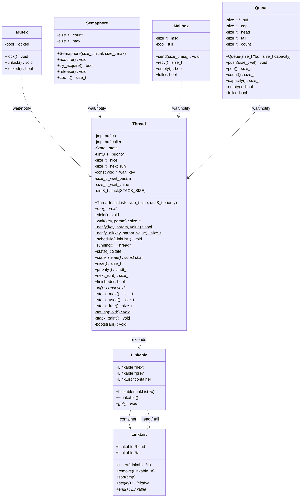
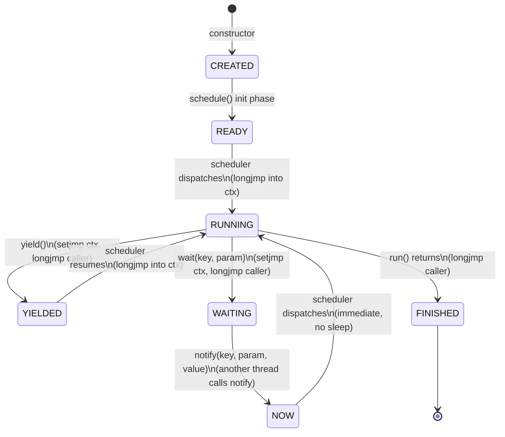
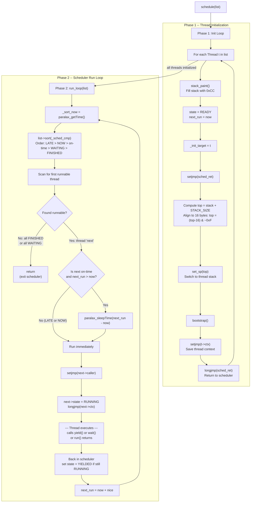
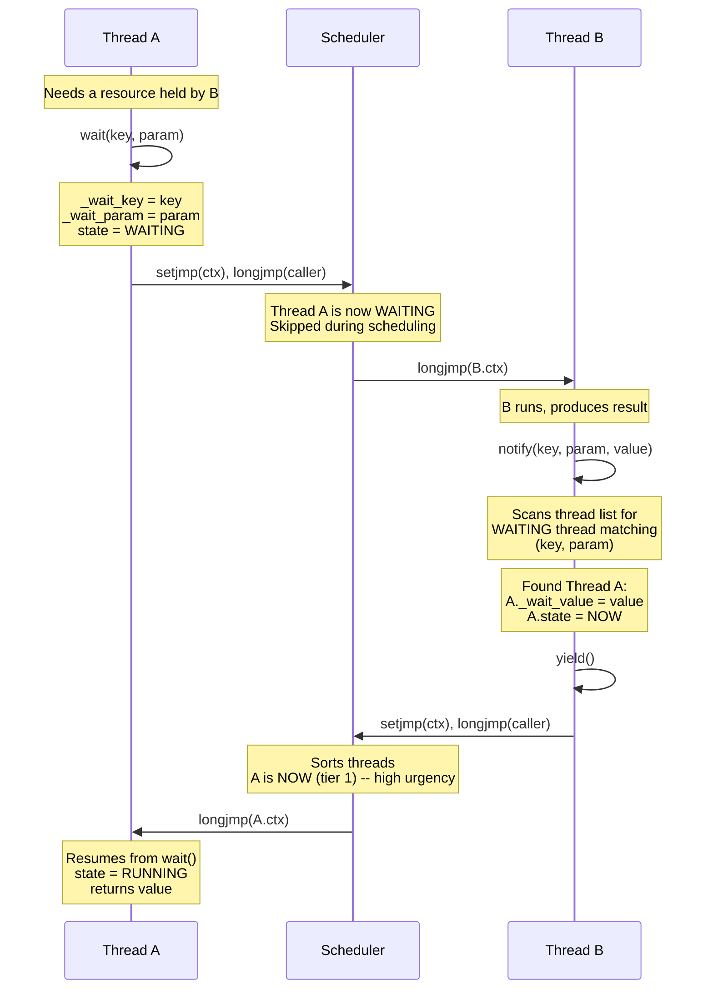
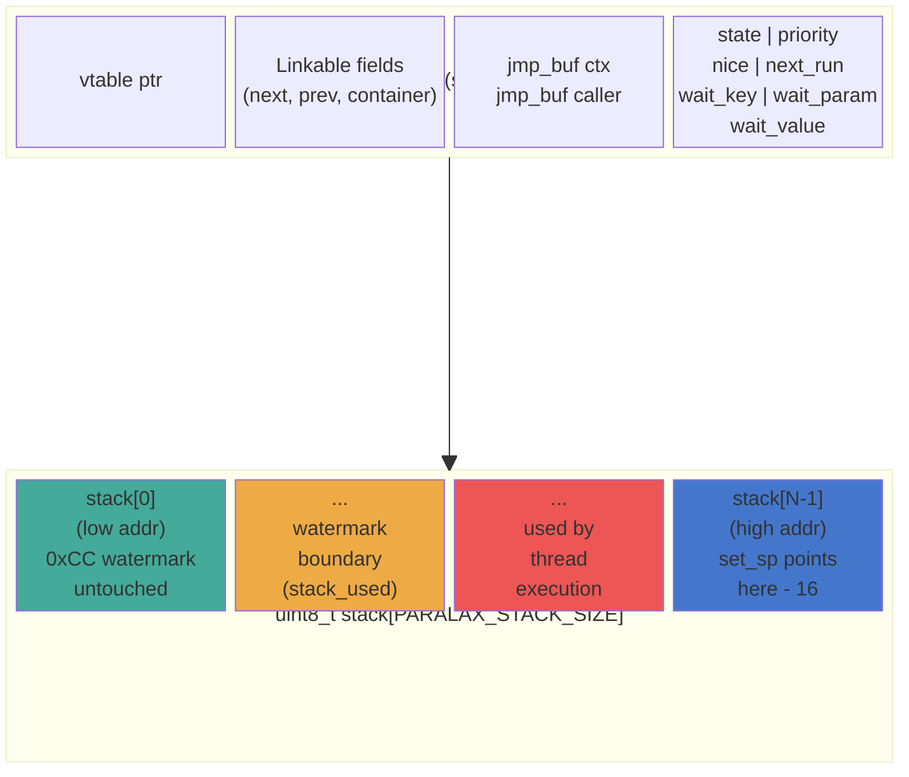

# Paralax Architecture Diagrams

All diagrams use [Mermaid](https://mermaid.js.org/) syntax and render natively
on GitHub.

---

## 1. Class Hierarchy



---

## 2. Thread State Machine



---

## 3. Scheduler Flow



---

## 4. Wait / Notify Sequence



---

## 5. Memory Layout



**Stack layout details:**

- The stack buffer `stack[STACK_SIZE]` is embedded at the end of the Thread object.
- `set_sp()` points the hardware stack pointer to `(stack + STACK_SIZE - 16) & ~0xF` (16-byte aligned, with 16 bytes of headroom).
- The stack **grows downward** from high addresses toward low addresses.
- `stack_paint()` fills the entire buffer with `0xCC` before first use.
- `stack_used()` scans from `stack[0]` upward, counting intact `0xCC` bytes. The first non-`0xCC` byte marks the high-water boundary. `stack_used = STACK_SIZE - clean_bytes`.
- `stack_free() = stack_max() - stack_used()`.

```
Address:  low ──────────────────────────────────────────── high

          [ 0xCC 0xCC 0xCC ... | used frames ... | ← SP ]
          ↑                     ↑                   ↑
          stack[0]              watermark boundary   set_sp target
          (untouched)           (stack_used)         (top - 16, aligned)
```
